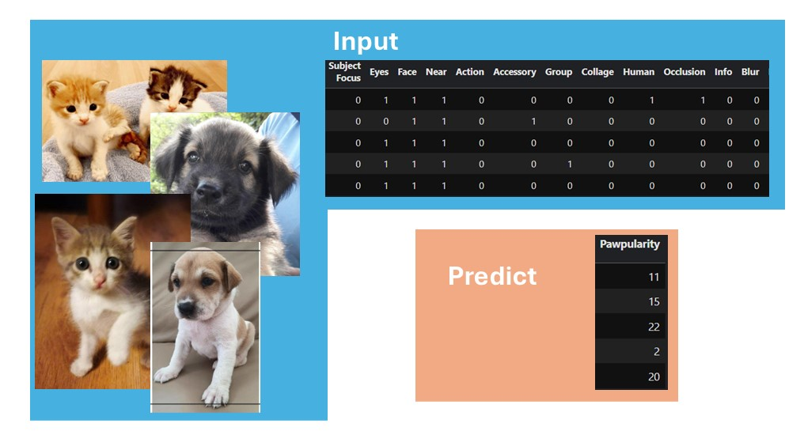

[](https://www.kaggle.com/competitions/petfinder-pawpularity-score)
[](https://www.kaggle.com/code/snehitchunarkar/ensembleset-svr-for-pawpularityscore)

# Task Description
In the competition, we are given images (of cats and dogs) and a file containing respective metadata. Using this, we need to predict the Pawpularity score for the picture of a cat or dog. A brief idea is shown in the figure below. \


# Architecture
The overall architecture for the task contains multiple ensemble sets, each with multiple models. Where all the models are frozen and only used to extract the image embedding from their output layers. The SVR is trainable, and the minimised function tunes the final output for optimized results. \


# Ensemble Set
A list of models used in each set is shown below.


# Key Packages
>## SVR: ```cuML``` vs ```sklearn```
>[](https://docs.rapids.ai/api/cuml/stable/api/) does the SVR calculation faster (using GPU accelerators). Note that while experimenting, it only worked with the ```Tesla T4``` GPU.
>If ```cuML``` doesn't work, then use [](https://scikit-learn.org/1.5/modules/generated/sklearn.svm.SVR.html) to compute SVR.

>## scipy.optimize
>To find the optimized combination of the ensemble set, a ```minimize``` package from the ```optimize``` library of ```scipy``` is used.\
>Link: [](https://docs.scipy.org/doc/scipy/reference/optimize.minimize-neldermead.html)


# Note
>## Execution
>Use the kaggle notebook for execution: [](https://www.kaggle.com/code/snehitchunarkar/ensembleset-svr-for-pawpularityscore) \
>Select the ```Copy & Edit``` option; it'll create a copy of the code with the necessary input files (which are not added to GitHub).

>## Saved embeddings
>To save time in training, the output from the ensemble set's models is saved in  ```.npz``` files. If required to use the models for training data, make the necessary changes in the ```Specify Inputs (all models)``` section.

>## Best Score
>

# Reference
[](https://www.kaggle.com/code/titericz/imagenet-embeddings-rapids-svr-finetuned-models) \
The above notebook by ```Giba``` on Kaggle is helpful for this work.
